# Evidencias de trabajo colaborativo en Git y GitHub

Este documento reúne las evidencias solicitadas para la actividad del repositorio `Juandavm12/TeamGitPractive_DockerDucks`. Las capturas fueron copiadas sin modificación a `docs/evidencias/` y se enlazan con rutas relativas para que el Markdown renderice dentro del repositorio.

## Resumen por integrante

| Integrante | Rama personal | Commit consola | Commit Visual Studio | Pull Request | Reviewer |
| --- | --- | --- | --- | --- | --- |
| Juan David Velasquez Murillo | `juan-velasquez` | `3b4bf1ba4c928a831f48c7f06f5c21e4599cfb3e` | `dc43df999967b4a1b1de4b0bb31a2e390a13d5ff` | [#1](https://github.com/Juandavm12/TeamGitPractive_DockerDucks/pull/1) | Alejandra Madrid |
| Alejandra Madrid Calderon | `alejandra-madrid` | `0d9318ca1e97684a4c11261446bbaf38d4c5aa29` | `58ffb11ce25956f71b95414f37a07eddafc449c3` | [#5](https://github.com/Juandavm12/TeamGitPractive_DockerDucks/pull/5) | Sara Regino Ferrano |
| Sara Regino Ferrano | `sara-ferraro` | `c463dfde216c9a959daf9ccf48a30e90162ce1e2` | `d05549632a8ff62546b11d3ab0c8455cb10614bd` | [#4](https://github.com/Juandavm12/TeamGitPractive_DockerDucks/pull/4) | Jose David Vasquez |
| Jose David Vasquez | `jose-vasquez` | `6c16d7a2515031005a7a2bb06ba9be84e283cc26` | `2caccfe69a9c70c6692d33cf07b562d6b6975841` | [#2](https://github.com/Juandavm12/TeamGitPractive_DockerDucks/pull/2) | Paula Andrea Calderon Quintero |
| Paula Andrea Calderon Quintero | `paula-calderon` | `871a284989b09ef24b571af87bbc05150632de16` | `95a8244a53841601d7e917e59d8358bf849a0bd7` | [#3](https://github.com/Juandavm12/TeamGitPractive_DockerDucks/pull/3) | Juan David Velasquez Murillo |

## Evidencias globales solicitadas

### Resolución de conflicto

- Pull Request donde se resolvió el conflicto: [PR #4](https://github.com/Juandavm12/TeamGitPractive_DockerDucks/pull/4), rama `sara-ferraro`.
- Commit de resolución de conflicto: `cb311ae392324e99cf62d17b56085c7c5accb80b` (`fix: resolve team message conflict.`).
- Merge commit del PR: `c05f71382a196605b38a695bde8df95430ac50a7`.

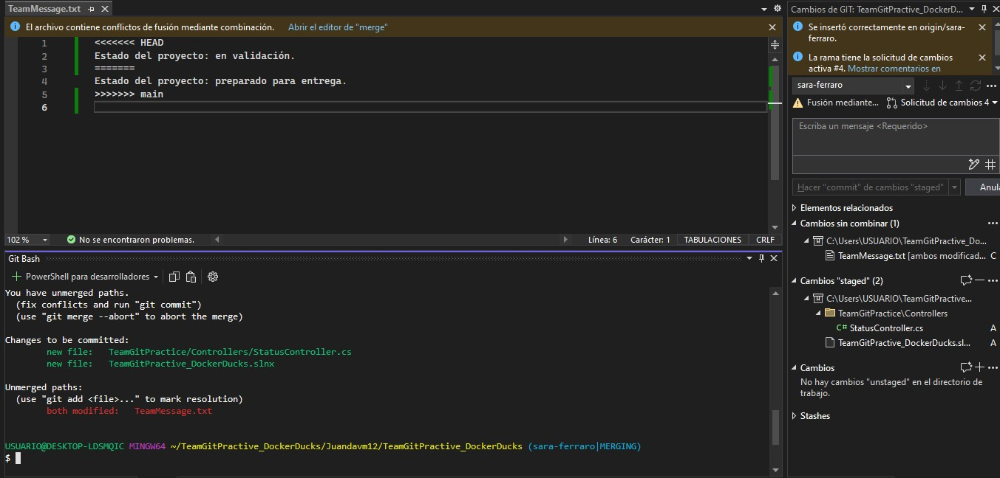
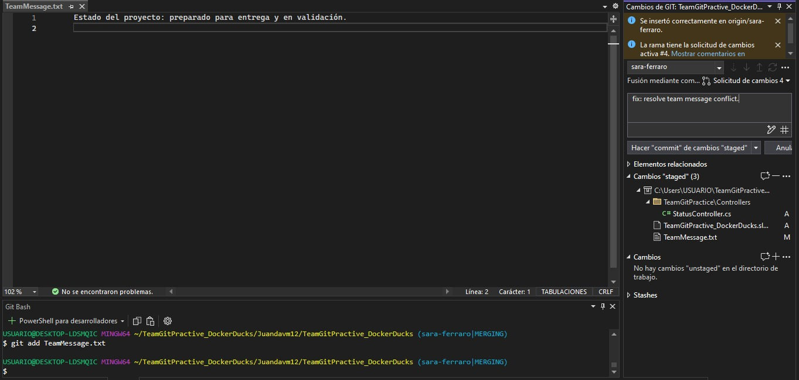

### Uso de `restore` y `restore --staged`

Se incluyen capturas de Jose y Paula con evidencias del uso de restauración del árbol de trabajo y del área de preparación:

- Evidencia de `git restore`: capturas `restore-working-tree`.
- Evidencia de `git restore --staged`: capturas `restore-staged`.

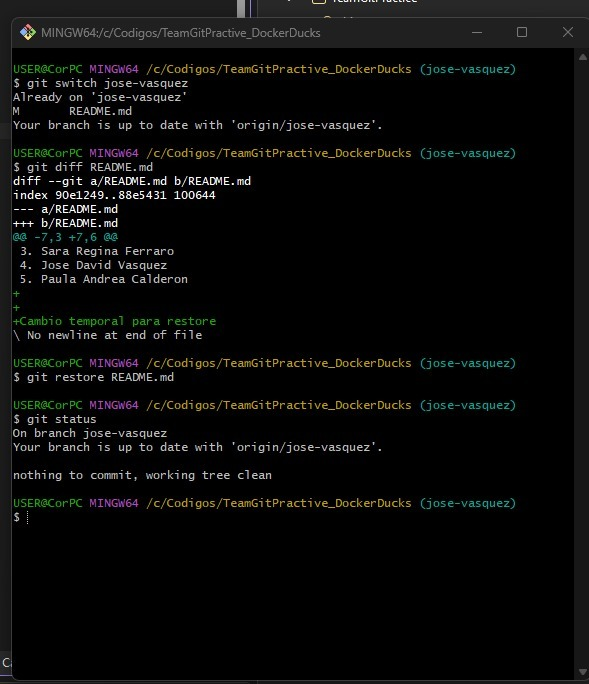
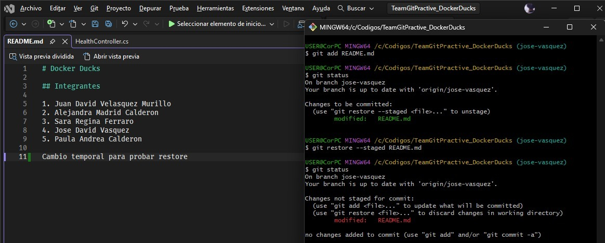
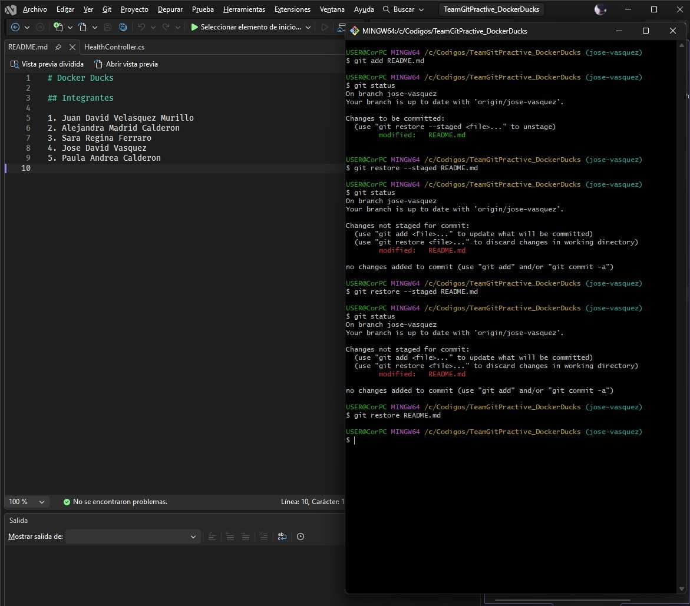
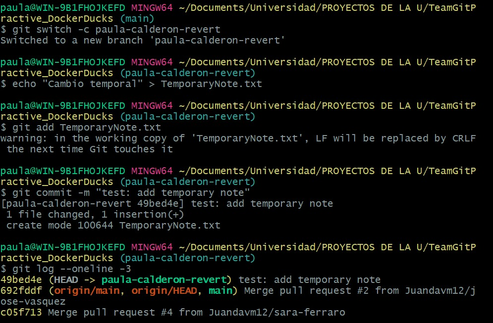
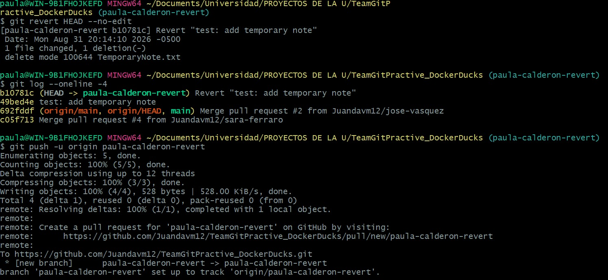

### Commit temporal y `revert`

- Commit temporal documentado en PR adicional de Alejandra: `7c7a5e32c44b9b9195b01b44158b04dc690db49b` ([PR #7](https://github.com/Juandavm12/TeamGitPractive_DockerDucks/pull/7)).
- Pull Request de revert: [PR #6](https://github.com/Juandavm12/TeamGitPractive_DockerDucks/pull/6), rama `revert-5-alejandra-madrid`.
- Commit generado por `revert`: `d09c400fbbb79828a7e247834995c4a9b7c3218c` (`Revert "feat(api): add MembersController endpoints"`).
- Merge commit del PR de revert: `8330e30775759120e01498c4addc694db15f2506`.

### Capturas de Git Changes y terminal

- Captura de Git Changes / Visual Studio:

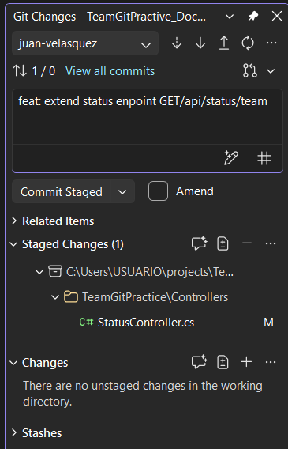

- Captura de Git Bash o terminal integrada:

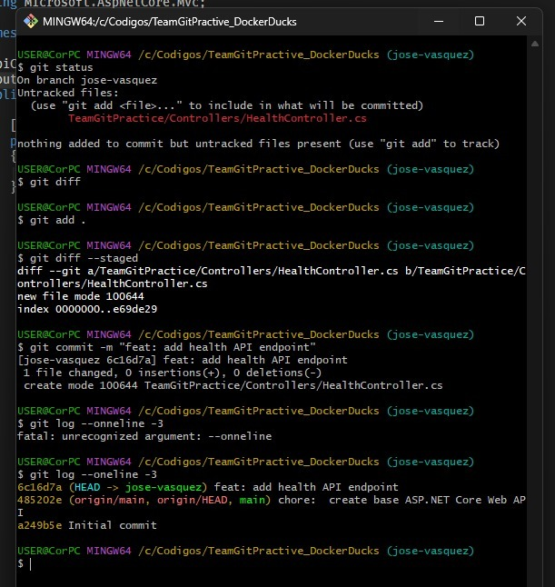

### Verificación de colaborador `oalarconpe`

La comprobación por GitHub API confirma que el usuario [`oalarconpe`](https://github.com/oalarconpe) tiene permisos de colaborador en el repositorio:

- Login: `oalarconpe`.
- Permiso reportado: `write`.
- Rol reportado: `write`.
- Permisos activos: `pull`, `push` y `triage`.

Comando de verificación usado: `gh api repos/Juandavm12/TeamGitPractive_DockerDucks/collaborators/oalarconpe/permission`.

## Evidencias por integrante

### Juan David Velasquez Murillo

- Rama: `juan-velasquez`.
- PR: [#1](https://github.com/Juandavm12/TeamGitPractive_DockerDucks/pull/1).
- Commit de consola: `3b4bf1ba4c928a831f48c7f06f5c21e4599cfb3e` (`feat: add assigned API endpoint GET/API/Status`).
- Commit de Visual Studio: `dc43df999967b4a1b1de4b0bb31a2e390a13d5ff` (`feat: extend status endpoint GET/api/status/team`).
- Merge commit: `10bdf8c53bde1ffb67590c0aaa4c0db072f7486b`.
- Reviewer: Alejandra Madrid.

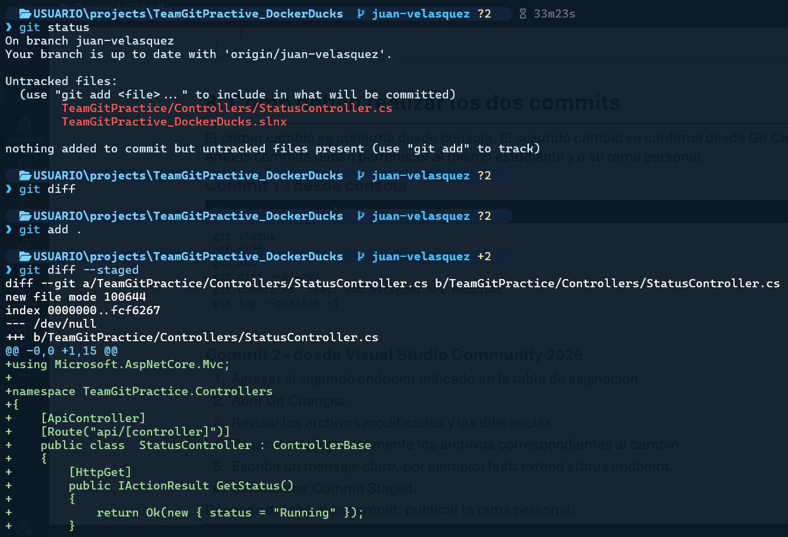
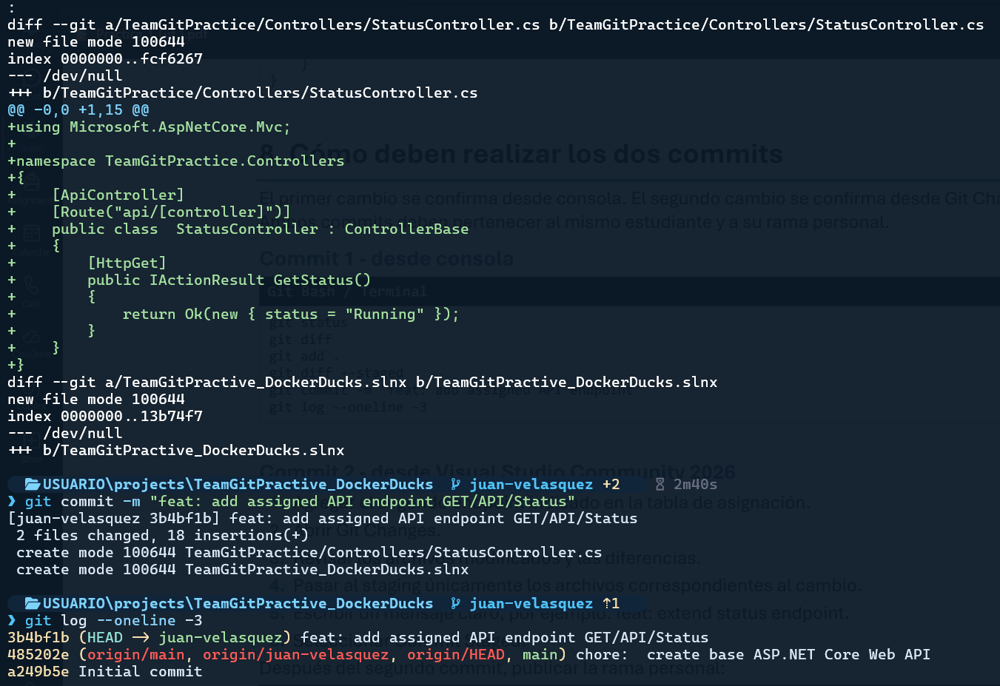

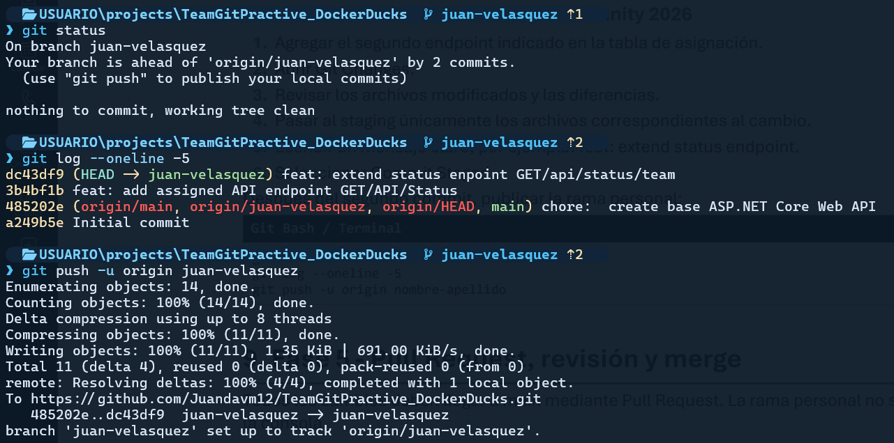

### Alejandra Madrid Calderon

- Rama: `alejandra-madrid`.
- PR principal: [#5](https://github.com/Juandavm12/TeamGitPractive_DockerDucks/pull/5).
- Commit de consola: `0d9318ca1e97684a4c11261446bbaf38d4c5aa29` (`feat: add members API endpoint`).
- Commit de Visual Studio: `58ffb11ce25956f71b95414f37a07eddafc449c3` (`feat: extend members API endpoint`).
- Merge commit: `09756b14437a5a4900ef10d32e314c6aad1d27c6`.
- Reviewer: Sara Regino Ferrano / GitHub login `ArsaOniSaturn`.
- PR adicional: [#7](https://github.com/Juandavm12/TeamGitPractive_DockerDucks/pull/7), commit `7c7a5e32c44b9b9195b01b44158b04dc690db49b`, merge `c5b56d9beebfc4dddd28d926d19e6ee088236dde`.

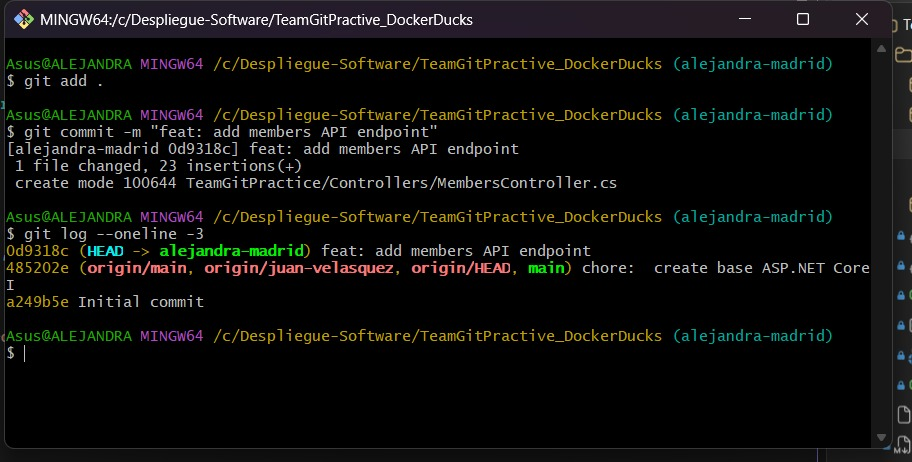
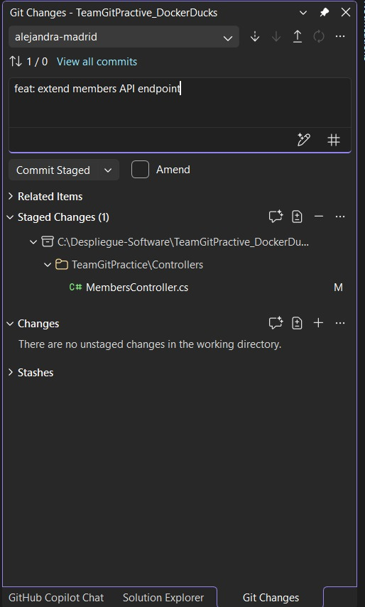

### Sara Regino Ferrano

- Rama: `sara-ferraro`.
- PR: [#4](https://github.com/Juandavm12/TeamGitPractive_DockerDucks/pull/4).
- Commit de consola: `c463dfde216c9a959daf9ccf48a30e90162ce1e2` (`GET/api/version`).
- Commit de Visual Studio: `d05549632a8ff62546b11d3ab0c8455cb10614bd` (`GET/api/version/platform`).
- Otros commits: `97d34bac48f6de37b166f95d273d1ee6bdaf5036` (`Modificar TeamMessage.txt`) y `cb311ae392324e99cf62d17b56085c7c5accb80b` (`fix: resolve team message conflict.`).
- Merge commit: `c05f71382a196605b38a695bde8df95430ac50a7`.
- Reviewer: Jose David Vasquez.

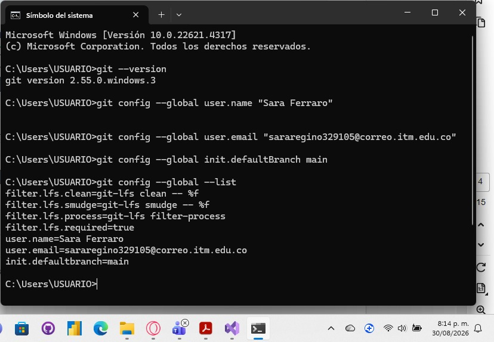
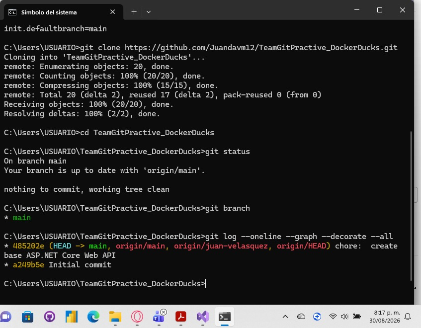
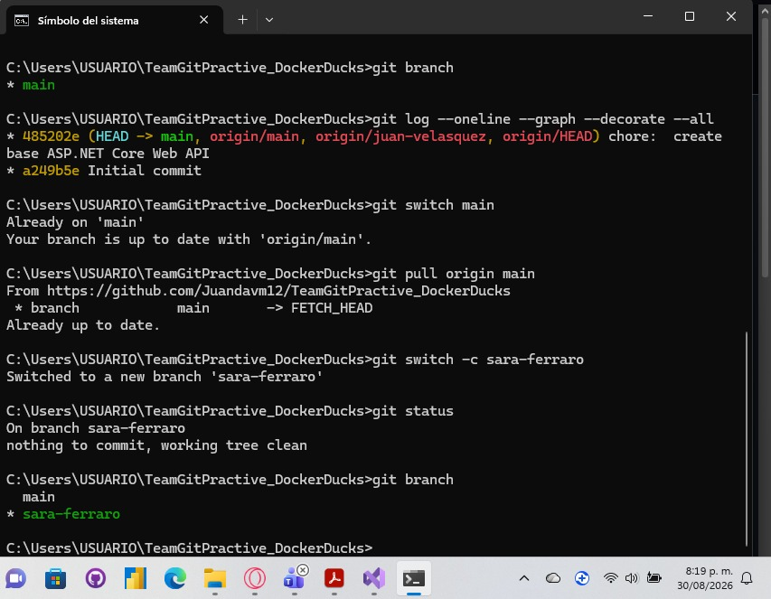
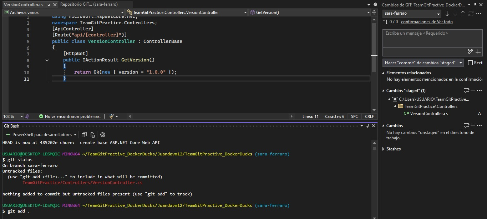
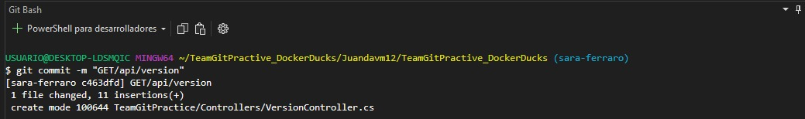
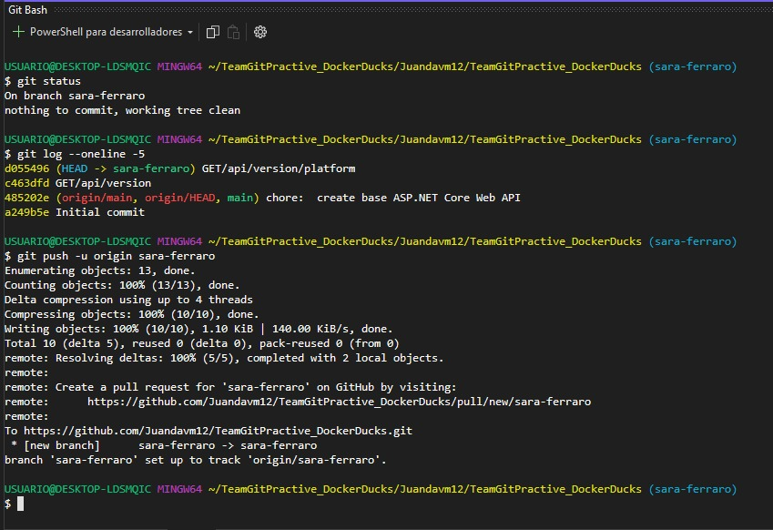
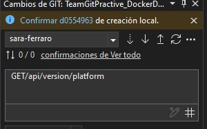

### Jose David Vasquez

- Rama: `jose-vasquez`.
- PR: [#2](https://github.com/Juandavm12/TeamGitPractive_DockerDucks/pull/2).
- Commit de consola: `6c16d7a2515031005a7a2bb06ba9be84e283cc26` (`feat: add health API endpoint`).
- Commit de Visual Studio: `2caccfe69a9c70c6692d33cf07b562d6b6975841` (`feat: extend health API endpoint`).
- Merge commit: `692fddf4a6cd351af7621fc68a518b895c7b5811`.
- Reviewer: Paula Andrea Calderon Quintero.

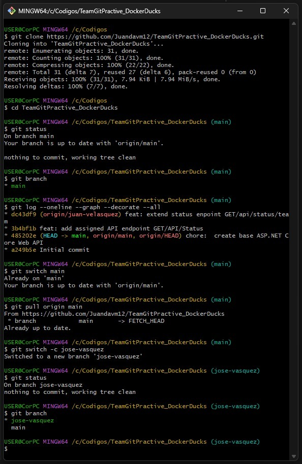

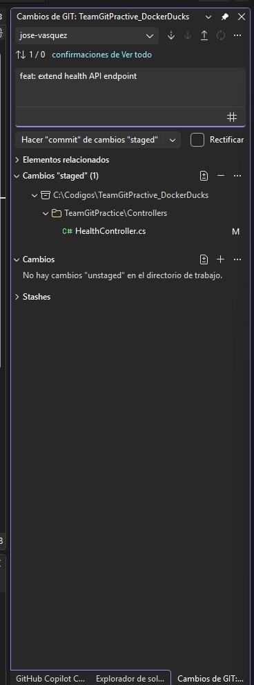
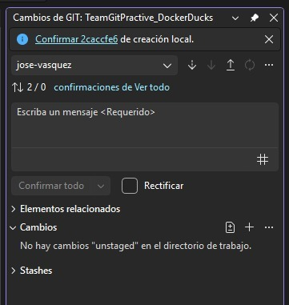
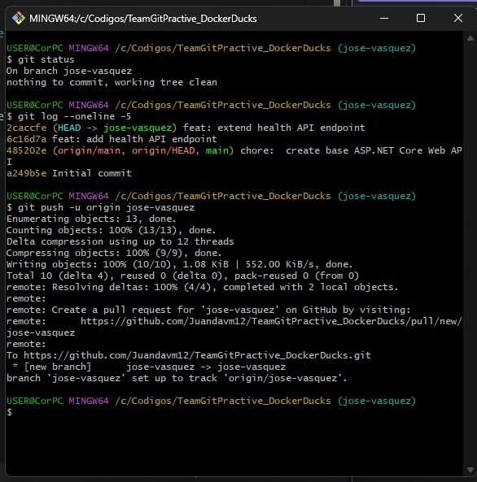

### Paula Andrea Calderon Quintero

- Rama: `paula-calderon`.
- PR: [#3](https://github.com/Juandavm12/TeamGitPractive_DockerDucks/pull/3).
- Commit de consola: `871a284989b09ef24b571af87bbc05150632de16` (`feat: add assigned API endpoint`).
- Commit de Visual Studio: `95a8244a53841601d7e917e59d8358bf849a0bd7` (`feat: add tools endpoint`).
- Merge commit: `3628dbb6ebd9c846438d67fdc66075ac98a4d9b5`.
- Reviewer: Juan David Velasquez Murillo.
- Nota: GitHub también registra un comentario de revisión de Copilot en el PR #3.

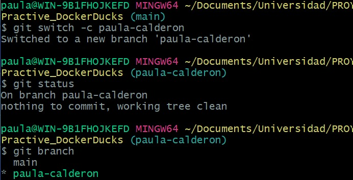
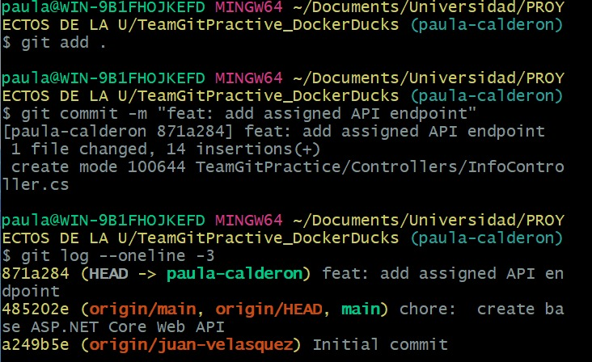
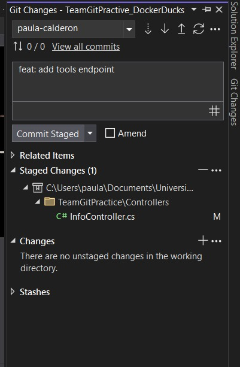
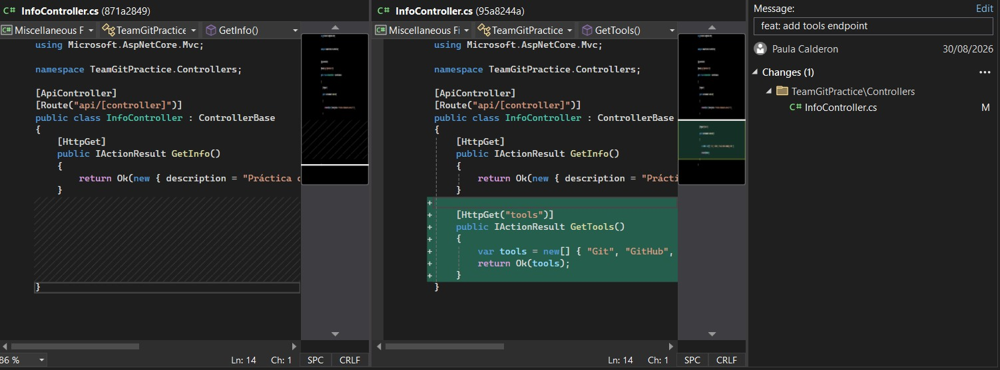
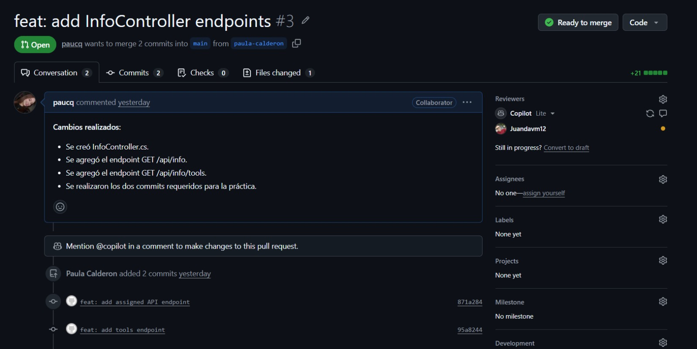

